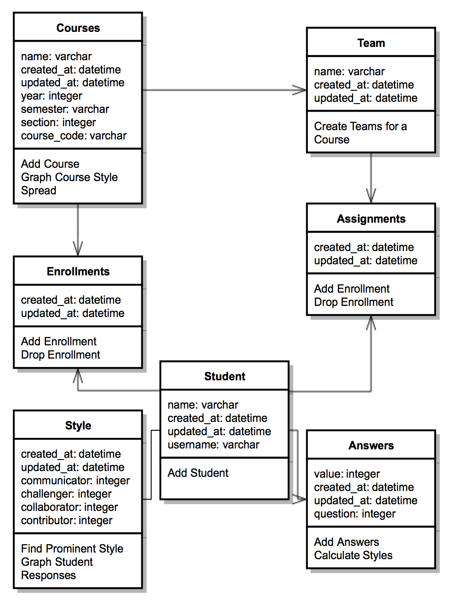

# teamwork-analysis

## Contents

* [Summary](#summary)
* [Contributors](#contributors)
* [Architecture](#architecture)
* [Installation](#installation)
* [Functionality](#functionality)
* [Known Problems](#known-problems)
* [Contributing](#contributing)
* [References](#references)

## Summary

This project is a teamwork analysis web app. It is designed to display results from the Parker Team Player Survey (read more about that [here](https://www.creativeorgdesign.com/tests_page.php?id=185)), which scores people as Contributors, Collaborators, Challengers, and Communicators. One can import the results from [this](https://docs.google.com/forms/d/1px6yEtC9zEG469OELr_1apL2iTUqwwDRYkoirncgVBI/edit) survey into the website. Once they have data in the database, the user can view an overall summary. This displays the primary, secondary, tertiary, and quaternary types for each student in the database. The user can also select an arbitrary number of students and view their scores for each of the four cateogries. 

## Contributors

* Nathan Justin 
* Sara McAllister
* Maeve Murphy
* Reagan Smith

## Architecture

All data processing is completed using Python 3. We use numpy with matplotlib to create the graphs. Our database interaction is also managed with python, and can be found in the `lib/dbCalls.py`. Ruby will use the Python scripts to display the resulting graphs on web pages, titled "Overall Distribution" and "Individual Statistics."

### Database Design

The database is implemented using SQLite, and follows this structure:

Currently, the app uses the Student, Answers, and Style tables. The remaining tables were built into the database for future functionality and use.

### Prerequisites

This application requires:
* Python 3.x (download [here](https://anaconda.org/anaconda/python));
    - specifically requires ImportEnum, matplotlib, and numpy libraries. The program will not work without these.
* Rails 5 with Ruby 2.2 or higher
    - Can be installed by following [these](http://railsapps.github.io/installing-rails.html) instructions
* Git

### Gems

* High Voltage [found here](https://github.com/thoughtbot/high_voltage)

## Installation

To use this app, you must first download the files. To do so, open up a terminal on your personal machine, navigate to the folder in which you'd like the files to exist, and run these commands  
`git clone https://github.com/nathanljustin/teamwork-analysis.git`  
`cd teamworkApp`  
`rails db:migrate`  
`bundle install`  
`rails s`

Then go to your web browser of choice, and navigate to `localhost:3000`. You are now free to use the teamwork analysis app!

## Functionality

* Import Data: The foundation of our Teamwork Survey web app is the data, so we must have an easy way to put data in the database. Upon first loading the web app, the database will be empty. The user’s only option will be to import data from a .csv file into the database, via a button on the main page. The web app assumes that the .csv file is set up such that it was an output from the [Teamwork Survey](https://docs.google.com/forms/d/1px6yEtC9zEG469OELr_1apL2iTUqwwDRYkoirncgVBI/edit) sent out by the muddersOnRails team. 

* Overall Distribution: Once students have been loaded into the database, a user can then examine the overall distribution of scores among them. Upon clicking “Overall distribution,” Python will generate a graph that Ruby will subsequently display for the user. The primary, secondary, tertiary, and quaternary types are displayed for each of the students in a split bar graph.

* Individual Statistics: In approaching team-building, a user will want to look at which students they have and what those students’ types are. If a user has particular students in mind for a team or project, they can examine their types. On the "Individual Statistics" page, the user can select any number of students and see their scores. If more than six students are selected, an average will be displayed. Otherwise, the scores for each of the students will be displayed in a split bar graph. 

## Known Problems

## Proposed Future Work

* Allow user to filter students by course
* Give the user the ability to save teams and compare them
* Create a script that generates teams from a dataset based on scores and team work research
* Method to save previous datasets when clearing out the database

## Contributing

1. Fork it!
2. Create your feature branch: `git checkout -b my-new-feature`
3. Commit your changes: `git commit -am 'Add some feature'`
4. Push to the branch: `git push origin my-new-feature`
5. Submit a pull request!

## References

### Database Setup

* https://stackoverflow.com/questions/2098131/rails-how-to-list-database-tables-objects-using-the-rails-console
* https://www.justinweiss.com/articles/creating-easy-readable-attributes-with-activerecord-enums/
* http://www.tomjewett.com/dbdesign/dbdesign.php?page=manymany.php
* http://guides.rubyonrails.org/v3.2.8/migrations.html

### Python Scripts

* https://docs.python.org/3.6/library/sqlite3.html
* https://pythonspot.com/en/matplotlib-bar-chart/
* https://docs.python.org/3/library/contextlib.html
* https://docs.python.org/3.6/library/unittest.html

### UI

* https://startbootstrap.com/template-overviews/bare/
* https://github.com/twbs/bootstrap-sass
* https://github.com/thoughtbot/high_voltage

### Github

* https://github.com/Kunena/Kunena-Forum/wiki/Create-a-new-branch-with-git-and-manage-branches

### Python Integration

* https://github.com/halostatue/rubypython
* https://mixandgo.com/blog/how-to-use-link_to-in-rails
* http://effbot.org/pyfaq/how-do-i-create-a-pyc-file.htm
* https://www.codesd.com/item/using-the-rubypython-gem-in-ruby-on-rails-how-do-you-call-a-python-script-from-the-lib-folder.html
* http://www.rubydoc.info/gems/rubypython/0.5.1/RubyPython
* https://github.com/halostatue/rubypython/issues/14

### Student Selection
* https://github.com/plataformatec/simple_form
* http://guides.rubyonrails.org/form_helpers.html

### Ruby on Rails

* https://www.tutorialspoint.com/ruby-on-rails/rails-controllers.htm
* http://guides.rubyonrails.org/action_controller_overview.html#methods-and-actions
* http://www.mattmorgante.com/technology/csv
* http://guides.rubyonrails.org/routing.html
* http://guides.rubyonrails.org/form_helpers.html#uploading-files
